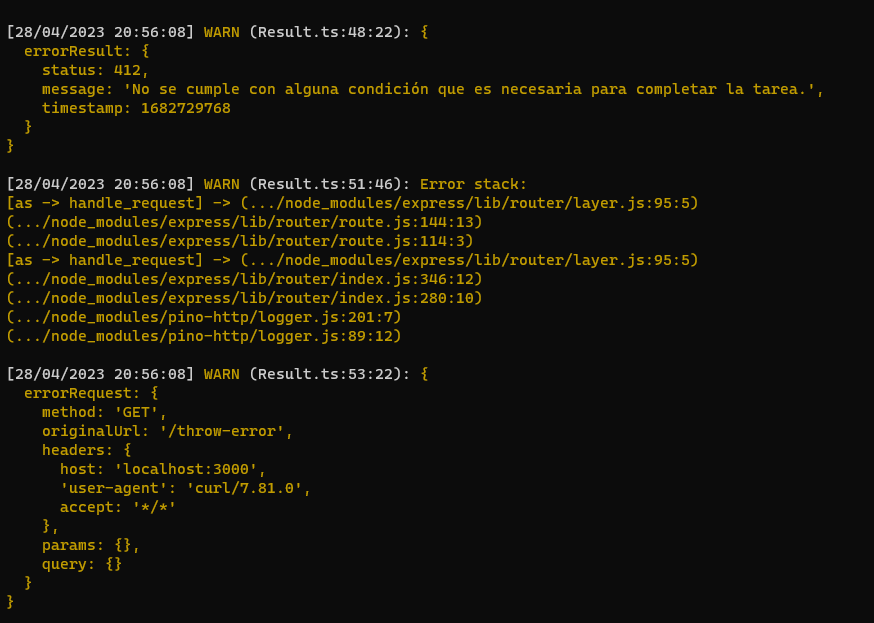

<h1 align="center">Express Response Handler</h1>

<p align="center">
  <a href="https://github.com/ElArteDelCodigo/express-response-handler/releases">
    
  </a>
  <a href="https://github.com/ElArteDelCodigo/express-response-handler/blob/main/LICENSE">
    
  </a>
</p>

Librería para gestionar las respuestas de un servicio web creado con express.

## Instalación

```bash
npm install @elartedelcodigo/express-response-handler
```

## Ejemplo

```txt
app
  └─ server.ts
```

Archivo `server.ts`

```ts
import express, { Express, NextFunction, Request, Response } from 'express'
import { ExpressLogger } from '@elartedelcodigo/express-logger'
import { ResponseHandler, Result, PreconditionFailedError } from '@elartedelcodigo/express-response-handler'

export class App {
  private app: Express

  constructor() {
    this.app = express()
  }

  initialize() {
    ExpressLogger.initialize(this.app)

    ResponseHandler.initialize(this.app, {
      logger: ExpressLogger.getInstance(),
    })

    // eslint-disable-next-line
    this.app.get('/estado', (req: Request, res: Response, next: NextFunction) => {
      try {
        const result = { servicio: 'activo' }
        return Result.ok(res, result)
      } catch (err) {
        return Result.fail(res, err)
      }
    })

    // eslint-disable-next-line
    this.app.get('/throw-error', (req: Request, res: Response, next: NextFunction) => {
      try {
        throw new PreconditionFailedError()
      } catch (err) {
        return Result.fail(res, err)
      }
    })

    // eslint-disable-next-line @typescript-eslint/no-unused-vars
    this.app.use((err: Error, req: Request, res: Response, next: NextFunction) => {
      return Result.fail(res, err)
    })
  }

  listen() {
    return this.app.listen(3000)
  }
}
```

Resultado 1:

```bash
curl --location 'http://localhost:3000/estado'
```

```json
{
  "status": 200,
  "message": "Tarea completada exitosamente.",
  "data": {
    "servicio": "activo"
  }
}
```

Resultado 2:

```bash
curl --location 'http://localhost:3000/throw-error'
```

```json
{
  "status": 412,
  "message": "No se cumple con alguna condición que es necesaria para completar la tarea.",
  "timestamp": 1682729565
}
```


